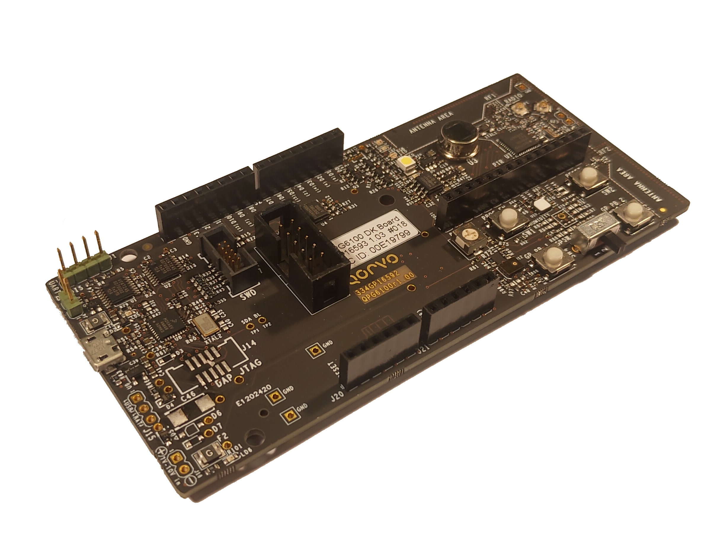

# QPGxxxx Connected Home over IP SDKs

This repository contains the specific files needed to enable CHIP on Qorvo platforms.
Source code in this repository is covered by the license agreement in [Qorvo_EULA.txt](Qorvo_EULA.txt).

Example applications on the different platforms are available in the CHIP repository,
which can be found under:

[https://github.com/project-chip/connectedhomeip](https://github.com/project-chip/connectedhomeip)

## Supported platforms

* QPG6100

CHIP examples are available for the QPG6100 Development Kit board.
All files required are stored in this repository under

```
./qpg6100
```



* QPG7015M

The QPG7015M Evaluation kit with RaspBerry Pi.
Support for this platform is under development.

All files will be made available under

```
./qpg7015m
```

## More information

Please visit www.qorvo.com for more information on our product line and support options.
