# Quickstart Guide Qorvo CHIP Evaluation Kit

# Table of Contents
* [Overview](#overview)
* [Required hardware](#required-hardware)
	* [Computer and QPG6100 DK board setup](#computer-and-qpg6100-dk-board-setup)
	* [Install the Android™ CHIPTool application](#install-the-android-chiptool-application)
* [QPG7015M Border Router setup](#qpg7015m-border-router-setup)
	* [Connect Android mobile device to the Wi-Fi access point](#connect-android-mobile-device-to-the-wi-fi-access-point)
	* [Form a new Thread network](#form-a-new-thread-network)
* [Provision the QPG6100 DK board using CHIPTool](#provision-the-qpg6100-dk-board-using-chiptool)
	* [Open CHIPTool on the Android Smartphone.](#open-chiptool-on-the-android-smartphone.)
	* [Retrieve the QR code URL](#retrieve-the-qr-code-url)
	* [Display the QR code](#display-the-qr-code)
	* [Scan the QR code](#scan-the-qr-code)
	* [Operate the light](#operate-the-light)
* [Shutting down the Raspberry Pi](#shutting-down-the-raspberry-pi)
* [Factory Reset](#factory-reset)
	* [QPG6100 DK board factory reset](#qpg6100-dk-board-factory-reset)
	* [QPG7015M development kit](#qpg7015m-development-kit)
* [Building from source](#building-from-source)
* [Important Notices](#important-notices)

## Overview

The CHIP Evaluation Kit contains the following hardware:

* Raspberry Pi 4 with QPG7015M daughter board add-on
* Micro SD card containing Linux OS, drivers and programmed with a Thread Border Router application
* Raspberry Pi USB-C power supply
* QPG6100 DK board, flashed with a CHIP Light application.
* QR code pointing to the quickstart guide

This Evaluation kit will allow you to control a CHIP Light device implemented
on the QPG6100 DK board using a WiFi connected Android™ device via the QPG7015M
DK that implements a Thread Border Router:

1. The Smartphone scans the Light device's QR code
2. A secure Bluetooth Low Energy connection is setup using the QR code information
3. Thread network credentials are passed to the QPG6100 Light device
4. The CHIP Light device joins the Thread network
5. The Smartphone can now communicate via IP over the QPG7015M based Wi-Fi-Thread router, the Light can be controlled by the Smartphone

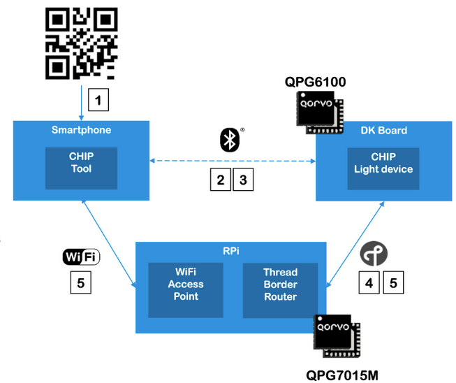

## Required hardware

Next to the CHIP Evaluation Kit, the user has to obtain the following items:

* An Android device to run the CHIPTool Smartphone Application.
* A personal computer (Windows/Linux/Mac) with PuTTY (or an equivalent serial terminal tool) installed and a free USB port.

### Computer and QPG6100 DK board setup

Use the supplied micro USB cable to connect the QPG6100DK board's micro USB connector (marked on the photo with a white circle) to a USB port of the computer.

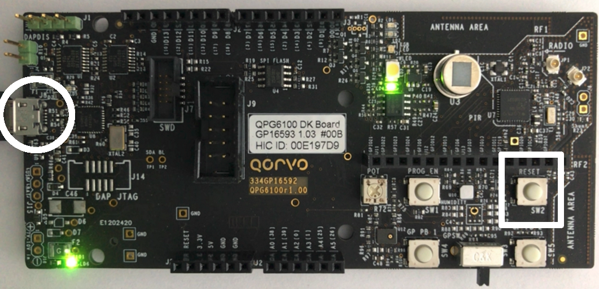

When the QPG6100DK board is connected to a computer, it will appear as a USB serial port device. The Light application will
send logging messages to this serial port.

To inspect the serial logging of the Light Application running on the QPG6100,
use a serial terminal such as [PuTTY](https://www.chiark.greenend.org.uk/~sgtatham/putty/latest.html).
To use PuTTY, enter the serial port your operating system assigned to the QPG6100 board and set the baudrate to 115200 (the default 8N1 parameters apply).

The serial logging will be needed later to commission the device.

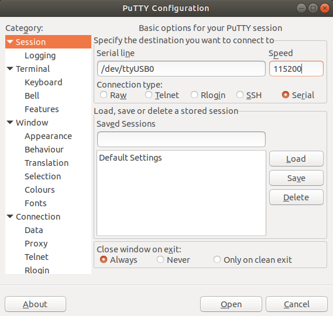

### Install the Android™ CHIPTool application

You can [download a CHIPTool application build from this GitHub repository](https://github.com/Qorvo/qpg-artifacts/blob/master/chip/evk/apk/app-debug-arm64.apk), open it on an Android Smartphone to install it.
Note: You may need to grant your web browser permission to install applications. You can do this via 'Apps and notifications' -> application name (e.g. Firefox) -> Allow installation of unknown apps (or similar, depending on the Android version)

Note that the CHIPTool Android application is a development tool developed and maintained within the CHIP community, its features are limited and do not represent a final product.

As development is still ongoing on both tooling and application side, the version of the Android CHIPTool application and the application running on the QPG6100 need to be aligned. Therefore only make use of the binaries / versions that are being referred to in this guide.

## QPG7015M Border Router setup

* Ensure the included SD-Card is properly inserted
* Ensure the QPG7015M is **plugged in the orientation** [shown on the photo](./imgs/qpg7015m_power.png) onto the Raspberry Pi 4.
* Connect the included USB-C power supply directly to the Raspberry Pi 4 board (marked by the white arrow on the photo). The USB-C connector on the QPG7015M radio board cannot be used for powering the Raspberry Pi.

Note: [Properly shut down the raspberry pi](#shutting-down-the-raspberry-pi) before turning off power to the device.

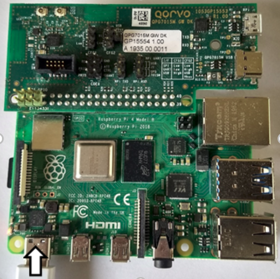

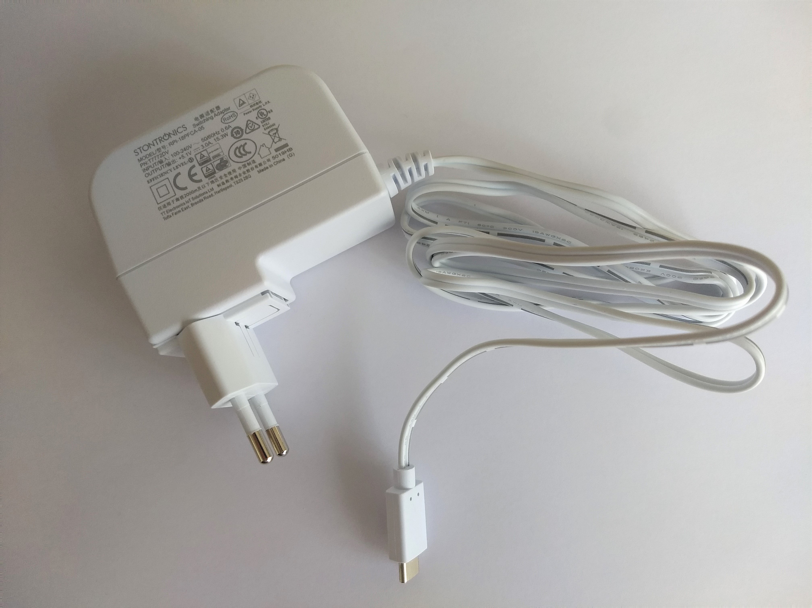

### Connect Android mobile device to the Wi-Fi access point
Connect your Android mobile device to the Raspberry Pi’s Wi-Fi access point. You can scan this QR code if your device supports it, otherwise, manually connect to the Wi-Fi network named “BorderRouter-AP” using the password `12345678`.

### Form a new Thread network

Visit the OT Border Router configuration page (only available when connected to the BorderRouter-AP) by navigating your Android web browser to http://192.168.2.2/ , or by scanning this QR code:

 ")

Note that the icons do not load if the Smartphone is only connected to the Borderrouter-AP WiFi. When there is no active (e.g. 3G) internet connection available, text descriptions like 'add_circle_outline' will be displayed instead of icons and it can take up to 2 minutes to load the webpage.

Navigate to ‘Form’ via the menu on the left. If the menu is not displayed click 'Home' in the top left first.

Click the ‘FORM’ button.

Confirm that you want to form a network.

**&#8594; Verify that the “FORM operation is successful” pop-up appears.**

## Provision the QPG6100 DK board using CHIPTool

The QPG6100 DK provided with this kit ships ready to be commissioned. If you already commissioned the device, [perform a factory reset](#qpg6100-dk-board-factory-reset) first.

### Open CHIPTool on the Android Smartphone.

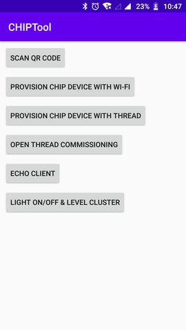

### Retrieve the QR code URL

- Recall the PuTTY application showing the serial output of the QPG6100 DK

- Push the reset button on the QPG6100DK board (marked with a white rectangle in the photo) to have the device show its start-up messages again.

- Locate and highlight (using the mouse) the URL that is displayed. The selected text will be copied into the copy/paste buffer.

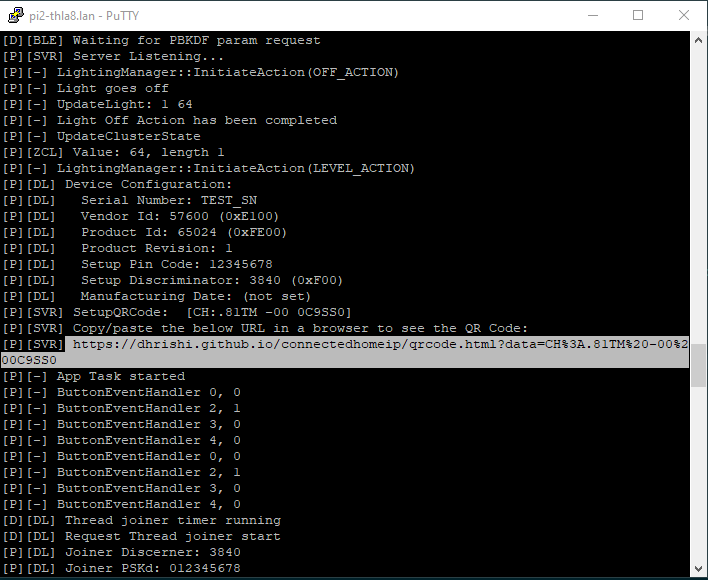

### Display the QR code

Open a web browser and navigate to the URL by pasting it in the address bar.  The URL points to a website that generates the required QR code to commission the device with.

### Scan the QR code

In CHIPTool, tap “Provision CHIP device with Thread” and scan the QR code displayed in your web browser.

If the device does not connect, press the reset button again on the QPG6100DK board.

The network should appear, click "save network".

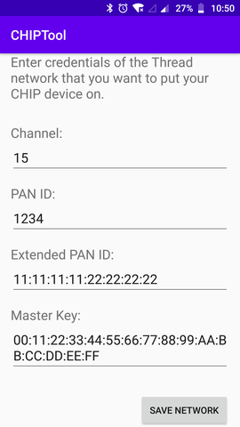

The message "provisioning completed" appears, and a slider and on/off controls are shown.

Note: If the CHIPTool application crashes, disable Bluetooth on the phone, then re-enable it again before retrying. You can also try killing all Apps running in the background using Android task manager.

### Operate the light

You should now be able to operate the light application running on the QPG6100 DK board using the controls.

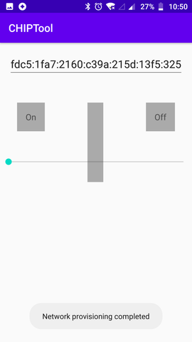

## Shutting down the Raspberry Pi

To avoid file corruption on the Raspberry Pi computer, you need to properly shut it down before disconnecting the power supply.

1. Connect your laptop to the BorderRouter-AP network (password `12345678`).
2. Use a SSH client (like PuTTY) to log in to the Raspberry Pi computer:
   - Enter the ip address `192.168.2.2` and click `Open`.
   - Click `Accept` in the pop-up window to accept the unknown host key (if this is the first time connecting).
   - At the `login as:` prompt, enter `pi`
   - At the `pi@192.168.2.2's password:` prompt, enter  `raspberry` (note that the password is not echoed back when typing)
3. Enter `sudo halt` and press ENTER.
4. The Raspberry Pi will disconnect the SSH session and shut down.

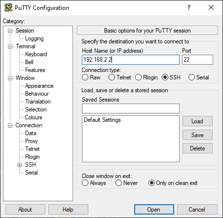

## Factory Reset

### QPG6100 DK board factory reset

You can hold the DK board's SW5 button for 10 seconds while it is powered to perform a factory reset.

The serial output will show:
`[P][DL] Performing factory reset`

After the board is reset it will start commissioning again.

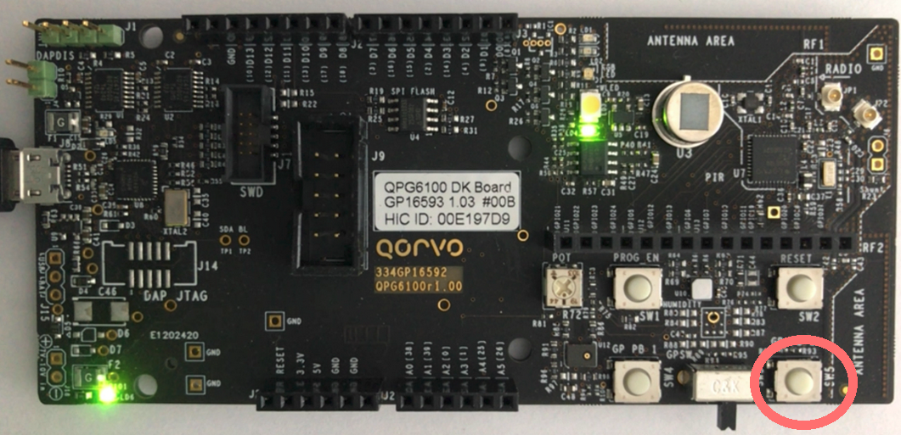

### QPG7015M development kit

There is no way to reset the border router, but you can [form a new Thread network](#form-a-new-thread-network).

To reboot the Raspberry Pi, follow the instructions to [shut down the raspberry pi](#shutting-down-the-raspberry-pi). Instead of `sudo halt` use `sudo reboot`.

## Building from source

To build the latest QPG6100 Light app, we [refer to the QPG6100 source code](https://github.com/project-chip/connectedhomeip/blob/master/examples/platform/qpg6100/README.md).

The QPG7015M based border router build documentation can be found [in the Qorvo OpenThread repository](https://github.com/Qorvo/qpg-openthread/blob/master/general/ot-br/README.md).

## Important Notices

This repository contains the specific files needed to enable CHIP on Qorvo platforms. Source code in this repository is covered by the license agreement in [Qorvo_EULA.txt](../../Qorvo_EULA.txt).
